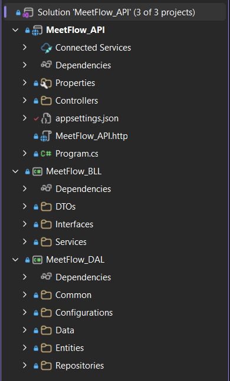

# System Architecture

MeetFlow follows a layered architecture that separates responsibilities between different layers of the application. This design improves maintainability, scalability, and code organization.

---

# Architecture Diagram

> The following diagram illustrates the overall backend architecture.



---

# Project Structure

```
MeetFlow
│
├── Backend
│   ├── MeetFlow_API
│   │   └── Controllers
│   │
│   ├── MeetFlow.BLL
│   │   ├── Services
│   │   ├── DTOs
│   │   └── Interfaces
│   │
│   ├── MeetFlow.DAL
│   │   ├── Entities
│   │   ├── Data
│   │   ├── Configurations
│   │   └── Repositories
│   │
│   └── MeetFlow.Core
│       ├── Interfaces
│       ├── Common
│       └── Shared Components
│
└── Frontend
```

---

# Layer Responsibilities

## API Layer (MeetFlow_API)

The API layer is responsible for handling incoming HTTP requests and returning HTTP responses.

Responsibilities include:

- API Controllers
- Authentication & Authorization
- Request Validation
- Response Handling
- Swagger Configuration

---

## Business Logic Layer (MeetFlow.BLL)

This layer contains the application's business rules and core logic.

Responsibilities include:

- Business Services
- DTO Mapping
- Validation Rules
- AI Task Extraction Logic
- Meeting and Workspace Management

---

## Data Access Layer (MeetFlow.DAL)

The Data Access Layer communicates with SQL Server using Entity Framework Core.

Responsibilities include:

- Entity Models
- DbContext
- Entity Configurations
- Repository Pattern
- Database Operations

---

## Core Layer (MeetFlow.Core)

The Core layer contains reusable components shared across the project.

Examples include:

- Interfaces
- Common Models
- Shared Utilities
- Base Classes

---

# Request Flow

A typical request passes through the following layers:

```
Client
   │
   ▼
API Controller
   │
   ▼
Business Service
   │
   ▼
Repository
   │
   ▼
Entity Framework Core
   │
   ▼
SQL Server Database
```

---

# Authentication Flow

MeetFlow uses JWT Authentication with Refresh Tokens.

```
User
   │
Register / Login
   │
   ▼
JWT Access Token
Refresh Token
   │
   ▼
Authorized API Requests
   │
Access Token Expired
   │
   ▼
Refresh Token
   │
   ▼
New Access Token
```

---

# Design Principles

The backend architecture follows several software engineering principles:

- Separation of Concerns (SoC)
- Layered Architecture
- Dependency Injection
- Repository Pattern
- DTO Pattern
- SOLID Principles
- Secure Authentication using JWT
- Scalable and Maintainable Design

---

# Technology Stack

| Technology | Purpose |
|------------|---------|
| ASP.NET Core Web API | REST API |
| C# | Backend Development |
| Entity Framework Core | ORM |
| SQL Server | Database |
| LINQ | Data Queries |
| JWT | Authentication |
| BCrypt | Password Hashing |
| Swagger | API Documentation |
| Google Gemini API | AI Task Extraction |

---

# Benefits of the Architecture

This architecture provides several advantages:

- Clear separation between presentation, business logic, and data access.
- Easier maintenance and future enhancements.
- Improved scalability for adding new features.
- Better testability through service abstraction.
- Reusable and organized codebase.
- Secure authentication and authorization.
