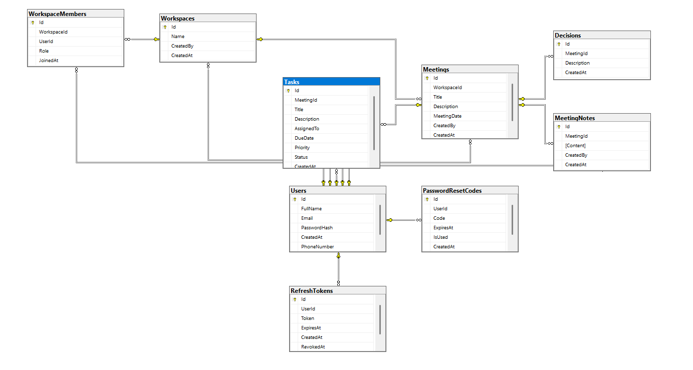

# Database Documentation

This document describes the database design used in the MeetFlow backend.

MeetFlow uses **SQL Server** as its relational database management system. The database is designed using normalization principles to ensure data consistency, scalability, and maintainability.

---

# Database Diagram

> The following Entity Relationship Diagram (ERD) illustrates the database structure and the relationships between entities.

---

# Database Overview

The database consists of the following main entities:

| Table | Purpose |
|---------|---------|
| Users | Stores user account information. |
| Workspaces | Represents collaborative workspaces. |
| WorkspaceMembers | Manages workspace membership and roles. |
| Meetings | Stores meetings created within workspaces. |
| MeetingNotes | Stores notes associated with meetings. |
| Decisions | Stores decisions made during meetings. |
| Tasks | Stores follow-up tasks generated from meetings. |
| RefreshTokens | Stores refresh tokens for JWT authentication. |
| PasswordResetCodes | Stores password reset verification codes. |

---

# Table Descriptions

## Users

Stores user account information and authentication data.

| Column | Description |
|---------|-------------|
| Id | Primary Key |
| FullName | User full name |
| Email | User email address |
| PasswordHash | Encrypted password |
| PhoneNumber | User phone number |
| CreatedAt | Account creation date |

---

## Workspaces

Represents collaborative workspaces where meetings are organized.

| Column | Description |
|---------|-------------|
| Id | Primary Key |
| Name | Workspace name |
| CreatedBy | User who created the workspace |
| CreatedAt | Workspace creation date |

---

## WorkspaceMembers

Represents the relationship between users and workspaces.

A workspace may contain multiple members, and a user may belong to multiple workspaces.

| Column | Description |
|---------|-------------|
| Id | Primary Key |
| WorkspaceId | Related workspace |
| UserId | Workspace member |
| Role | Member role (Owner / Member) |
| JoinedAt | Join date |

---

## Meetings

Stores meetings that belong to a workspace.

| Column | Description |
|---------|-------------|
| Id | Primary Key |
| WorkspaceId | Related workspace |
| Title | Meeting title |
| Description | Meeting description |
| MeetingDate | Scheduled meeting date |
| CreatedBy | User who created the meeting |
| CreatedAt | Creation timestamp |

---

## MeetingNotes

Stores notes recorded during meetings.

| Column | Description |
|---------|-------------|
| Id | Primary Key |
| MeetingId | Related meeting |
| Content | Meeting notes |
| CreatedBy | Author of the note |
| CreatedAt | Creation timestamp |

---

## Decisions

Stores important decisions taken during meetings.

| Column | Description |
|---------|-------------|
| Id | Primary Key |
| MeetingId | Related meeting |
| Description | Decision description |
| CreatedAt | Creation timestamp |

---

## Tasks

Stores follow-up tasks assigned after meetings.

| Column | Description |
|---------|-------------|
| Id | Primary Key |
| MeetingId | Related meeting |
| Title | Task title |
| Description | Task description |
| AssignedTo | Assigned user |
| DueDate | Due date |
| Priority | Task priority |
| Status | Current task status |
| CreatedAt | Creation timestamp |

---

## RefreshTokens

Stores refresh tokens used for JWT authentication.

| Column | Description |
|---------|-------------|
| Id | Primary Key |
| UserId | Related user |
| Token | Refresh token |
| ExpiresAt | Expiration date |
| RevokedAt | Revocation date |
| CreatedAt | Creation timestamp |

---

## PasswordResetCodes

Stores verification codes used for password recovery.

| Column | Description |
|---------|-------------|
| Id | Primary Key |
| UserId | Related user |
| Code | Verification code |
| ExpiresAt | Expiration date |
| IsUsed | Indicates whether the code has been used |
| CreatedAt | Creation timestamp |

---

# Entity Relationships

The database follows a relational model with well-defined foreign key constraints.

### Workspace Relationships

- One **Workspace** can contain many **Meetings**.
- One **Workspace** can contain many **Workspace Members**.

---

### User Relationships

- One **User** can belong to multiple **Workspaces**.
- One **User** can create multiple **Meetings**.
- One **User** can create multiple **Meeting Notes**.
- One **User** can be assigned multiple **Tasks**.
- One **User** can own multiple **Refresh Tokens**.
- One **User** can have multiple **Password Reset Codes**.

---

### Meeting Relationships

Each meeting may contain:

- Multiple Meeting Notes
- Multiple Decisions
- Multiple Tasks

---

# Database Design Principles

The database was designed following common relational database best practices:

- Normalized relational schema.
- Primary Keys for every table.
- Foreign Key constraints to maintain referential integrity.
- Support for one-to-many and many-to-many relationships.
- Separation of authentication data from business entities.
- Timestamp fields for auditing purposes.
- Role-based workspace membership.

---

# Summary

The MeetFlow database provides a scalable and maintainable foundation for managing collaborative workspaces, meetings, meeting outcomes, authentication, and AI-assisted task management while preserving data consistency through relational design.
